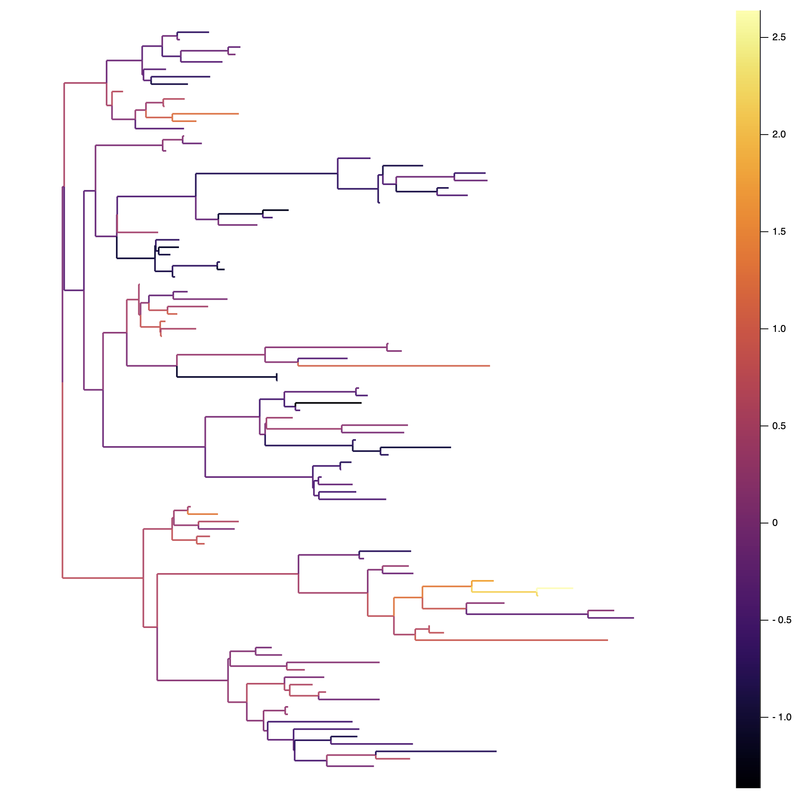
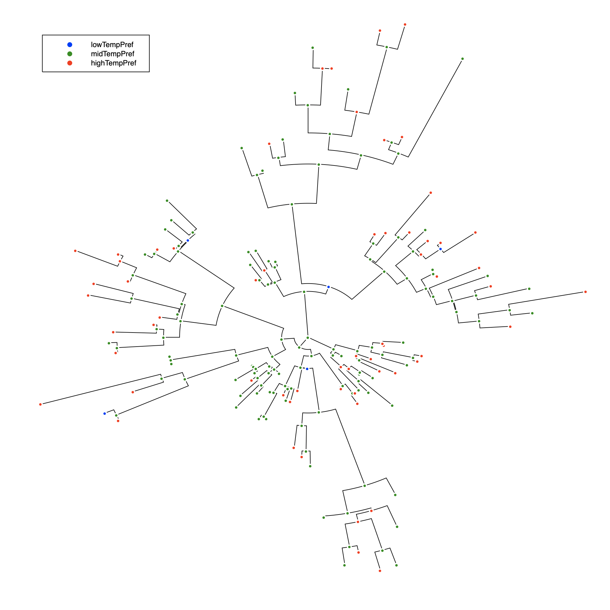

# Phylo

*Package for creating and manipulating phylogenies*

| **Documentation** | **Build Status of master** |
|:-----------------:|:--------------------------:|
| [![][docs-stable-img]][docs-stable-url] | [![][travis-img]][travis-url] [![][appveyor-img]][appveyor-url] |
| [![][docs-latest-img]][docs-latest-url] | [![][codecov-img]][codecov-url] [![][coveralls-img]][coveralls-url] |

## Installation

The package is registered in the `General` registry so can be
installed with `add`. For example on Julia v1.4:

```julia
(@v1.4) pkg> add Phylo
 Resolving package versions...
  Updating `~/.julia/environments/v1.4/Project.toml`
  [aea672f4] + Phylo v0.4.0
  Updating `~/.julia/environments/v1.4/Manifest.toml`

(@v1.4) pkg>
```

## Project Status

The package is confirmed to work against the current Julia v1.4 release
and v1.0.x on Linux, macOS, and Windows. It is also tested against
nightly.

## Contributing and Questions

Contributions are very welcome, as are feature requests and suggestions.
Please open an [issue][issues-url] if you encounter any problems or would
just like to ask a question.

## Summary

**Phylo** is a [Julia](http://www.julialang.org) package that provides
functionality for generating phylogenetic trees to feed into our
[Diversity][diversity-url] package to calculate phylogenetic
diversity. `Phylo` is currently in *beta*, but is probably still
missing much of the functionality that people may desire, so please
[raise an issue][issues-url] if/when you find problems or missing
functionality - don't assume that I know!

Currently the package can be used to make trees manually, to generate
random trees using the framework from `Distributions`, and to read
newick and nexus format trees from files. It can also be used to
evolve continuous and discrete traits on the resultant phylogenies,
and plot all of this using `Plots` recipes. Finally, the trees and
traits are capable of handling `Unitful` units, so the branch lengths
can be time based, and traits that relate directly to physical units
(e.g. size) can be directly evolved.

### Random tree generation

For instance, to construct a sampler for 5 tip non-ultrametric trees,
and then generate one or two random tree of that type (the examples
below are from the master branch, but work similarly on the current
release):

```julia
julia> using Phylo

julia> nu = Nonultrametric(5);

julia> tree = rand(nu)
LinkTree{OneRoot,String,LinkNode{OneRoot,String,Dict{String,Any},LinkBranch{OneRoot,String,Dict{String,Any}}},LinkBranch{OneRoot,String,Dict{String,Any}},Dict{String,Any}} with 5 tips, 9 nodes and 8 branches.
Leaf names are tip 1, tip 2, tip 3, tip 4 and tip 5

julia> trees = rand(nu, ["Tree 1", "Tree 2"])
TreeSet with 2 trees, each with 5 tips.
Tree names are Tree 2 and Tree 1

Tree 2: LinkTree{OneRoot,String,LinkNode{OneRoot,String,Dict{String,Any},LinkBranch{OneRoot,String,Dict{String,Any}}},LinkBranch{OneRoot,String,Dict{String,Any}},Dict{String,Any}} with 5 tips, 9 nodes and 8 branches.
Leaf names are tip 1, tip 2, tip 3, tip 4 and tip 5

Tree 1: LinkTree{OneRoot,String,LinkNode{OneRoot,String,Dict{String,Any},LinkBranch{OneRoot,String,Dict{String,Any}}},LinkBranch{OneRoot,String,Dict{String,Any}},Dict{String,Any}} with 5 tips, 9 nodes and 8 branches.
Leaf names are tip 1, tip 2, tip 3, tip 4 and tip 5
```

### Tree traversal

The code also provides iterators, and filtered iterators over the branches,
nodes, branchnames and nodenames of a tree, though this may soon be superseded
by a simpler strategy.

```julia
julia> traversal(tree, inorder)
9-element Array{LinkNode{OneRoot,String,Dict{String,Any},LinkBranch{OneRoot,String,Dict{String,Any}}},1}:
 LinkNode tip 1, a tip of the tree with an incoming connection (branch 5).

 LinkNode Node 8, an internal node with 1 inbound and 2 outbound connections (branches 7 and 5, 6)

 LinkNode tip 3, a tip of the tree with an incoming connection (branch 6).

 LinkNode Node 9, a root node with 2 outbound connections (branches 7, 8)

 LinkNode tip 5, a tip of the tree with an incoming connection (branch 3).

 LinkNode Node 7, an internal node with 1 inbound and 2 outbound connections (branches 8 and 3, 4)

 LinkNode tip 2, a tip of the tree with an incoming connection (branch 1).

 LinkNode Node 6, an internal node with 1 inbound and 2 outbound connections (branches 4 and 1, 2)

 LinkNode tip 4, a tip of the tree with an incoming connection (branch 2).


julia> getnodename.(tree, traversal(tree, preorder))
9-element Array{String,1}:
 "Node 9"
 "Node 8"
 "tip 1"
 "tip 3"
 "Node 7"
 "tip 5"
 "Node 6"
 "tip 2"
 "tip 4"

julia> collect(nodenamefilter(isleaf, tree))
5-element Array{String,1}:
 "tip 1"
 "tip 2"
 "tip 3"
 "tip 4"
 "tip 5"
```

The current main purpose of this package is to provide a framework for
phylogenetics to use in our [Diversity][diversity-url] package, and
they will both be adapted as appropriate until both are functioning as
required (though they are currently working together reasonably successfully).

### Reading from a file

It can also read newick trees either from strings or files:

```julia
julia> using Phylo

julia> simpletree = parsenewick("((,Tip:1.0)Internal,)Root;")
LinkTree{OneRoot,String,LinkNode{OneRoot,String,Dict{String,Any},LinkBranch{OneRoot,String,Dict{String,Any}}},LinkBranch{OneRoot,String,Dict{String,Any}},Dict{String,Any}} with 3 tips, 5 nodes and 4 branches.
Leaf names are Node 1, Tip and Node 4

julia> getbranchname.(simpletree, getbranches(simpletree))
4-element Array{Int64,1}:
 1
 2
 3
 4

julia> tree = open(parsenewick, Phylo.path("H1N1.newick"))
LinkTree{OneRoot,String,LinkNode{OneRoot,String,Dict{String,Any},LinkBranch{OneRoot,String,Dict{String,Any}}},LinkBranch{OneRoot,String,Dict{String,Any}},Dict{String,Any}} with 507 tips, 1013 nodes and 1012 branches.
Leaf names are 44, 429, 294, 295, 227, ... [501 omitted] ... and 418
```
And it can read nexus trees from files too:

```julia
julia> ts = open(parsenexus, Phylo.path("H1N1.trees"))
[ Info: Created a tree called 'TREE1'
[ Info: Created a tree called 'TREE2'
TreeSet with 2 trees, each with 507 tips.
Tree names are TREE2 and TREE1

TREE2: LinkTree{OneRoot,String,LinkNode{OneRoot,String,Dict{String,Any},LinkBranch{OneRoot,String,Dict{String,Any}}},LinkBranch{OneRoot,String,Dict{String,Any}},Dict{String,Any}} with 507 tips, 1013 nodes and 1012 branches.
Leaf names are H1N1_A_MIYAGI_3_2000, H1N1_A_PARMA_6_2008, H1N1_A_AKITA_86_2002, H1N1_A_DAKAR_14_1997, H1N1_A_EGYPT_84_2001, ... [501 omitted] ... and H1N1_A_HONGKONG_2070_1999

TREE1: LinkTree{OneRoot,String,LinkNode{OneRoot,String,Dict{String,Any},LinkBranch{OneRoot,String,Dict{String,Any}}},LinkBranch{OneRoot,String,Dict{String,Any}},Dict{String,Any}} with 507 tips, 1013 nodes and 1012 branches.
Leaf names are H1N1_A_MIYAGI_3_2000, H1N1_A_PARMA_6_2008, H1N1_A_AKITA_86_2002, H1N1_A_DAKAR_14_1997, H1N1_A_EGYPT_84_2001, ... [501 omitted] ... and H1N1_A_HONGKONG_2070_1999

julia> ts["TREE1"]
LinkTree{OneRoot,String,LinkNode{OneRoot,String,Dict{String,Any},LinkBranch{OneRoot,String,Dict{String,Any}}},LinkBranch{OneRoot,String,Dict{String,Any}},Dict{String,Any}} with 507 tips, 1013 nodes and 1012 branches.
Leaf names are H1N1_A_MIYAGI_3_2000, H1N1_A_PARMA_6_2008, H1N1_A_AKITA_86_2002, H1N1_A_DAKAR_14_1997, H1N1_A_EGYPT_84_2001, ... [501 omitted] ... and H1N1_A_HONGKONG_2070_1999


julia> gettreeinfo(ts)
Dict{String,Dict{String,Any}} with 2 entries:
  "TREE2" => Dict{String,Any}("lnP"=>-1.0)
  "TREE1" => Dict{String,Any}("lnP"=>1.0)

julia> gettreeinfo(ts, "TREE1")
Dict{String,Any} with 1 entry:
  "lnP" => 1.0
```

### R interface

And while we wait for me (or kind [contributors][pr-url]!) to fill out
the other extensive functionality that many phylogenetics packages
have in other languages, the other important feature that it offers is
a fully(?)-functional interface to R, allowing any existing R library
functions to be carried out on julia trees, and trees to be read from
disk and written using R helper functions. Naturally the medium-term
plan is to fill in as many of these gaps as possible in Julia, so the R interface does not make RCall a dependency of the package (we use the
`Requires` package to avoid dependencies). Instead, if you want to use
the R interface you just need to use both packages:

```julia
julia> using Phylo

julia> using RCall
Creating Phylo RCall interface...

R> library(ape)
```

You can then translate back and forth using `rcopy` on
R `phylo` objects, and `RObject` constructors on julia `NamedTree`
types to keep them in Julia or `@rput` to move the object into R:

```julia
julia> rt = rcall(:rtree, 10)
RObject{VecSxp}

Phylogenetic tree with 10 tips and 9 internal nodes.

Tip labels:
	t1, t4, t3, t6, t9, t7, ...

Rooted; includes branch lengths.


julia> jt = rcopy(RootedTree, rt)
LinkTree{OneRoot,String,LinkNode{OneRoot,String,Dict{String,Any},LinkBranch{OneRoot,String,Dict{String,Any}}},LinkBranch{OneRoot,String,Dict{String,Any}},Dict{String,Any}} with 10 tips, 19 nodes and 18 branches.
Leaf names are t1, t4, t3, t6, t9, ... [4 omitted] ... and t8


julia> rjt = RObject(jt); # manually translate it back to R

R> all.equal($rjt, $rt)
[1] TRUE

julia> @rput rt; # Or use macros to pass R object back to R

julia> @rput jt; # And automatically translate jt back to R

R> jt

Phylogenetic tree with 10 tips and 9 internal nodes.

Tip labels:
	t1, t4, t3, t6, t9, t7, ...

Rooted; includes branch lengths.

R> if (all.equal(rt, jt)) "no damage in translation"
[1] "no damage in translation"
```

For the time being the code will only work with rooted trees
with named tips and branch lengths. If there's [demand][issues-url]
for other types of trees, I'll look into it.

### Trait evolution

As far as traits are concerned, these can be continuous pr
discrete. First a continuous trait:

```julia
julia> using Phylo, Plots, DataFrames, Random

julia> tree = rand(Nonultrametric(100)) # Defaults to mean tree depth of 1.0
LinkTree{OneRoot,String,LinkNode{OneRoot,String,Dict{String,Any},LinkBranch{OneRoot,String,Dict{String,Any},Float64}},LinkBranch{OneRoot,String,Dict{String,Any},Float64},Dict{String,Any}} with 100 tips, 199 nodes and 198 branches.
Leaf names are tip 21, tip 81, tip 32, tip 12, tip 51, ... [94 omitted] ... and tip 93

julia> rand!(BrownianTrait(tree, "Trait"), tree)  # Defaults to starting at 0.0, variance 1.0
LinkTree{OneRoot,String,LinkNode{OneRoot,String,Dict{String,Any},LinkBranch{OneRoot,String,Dict{String,Any},Float64}},LinkBranch{OneRoot,String,Dict{String,Any},Float64},Dict{String,Any}} with 100 tips, 199 nodes and 198 branches.
Leaf names are tip 21, tip 81, tip 32, tip 12, tip 51, ... [94 omitted] ... and tip 93

julia> plot(tree, line_z = "Trait", lw = 2)

julia> d = DataFrame(nodename=getnodename.(tree, traversal(tree, preorder)), trait=getnodedata.(tree, traversal(tree, preorder), "Trait"))
199×2 DataFrame
│ Row │ nodename │ trait     │
│     │ String   │ Float64   │
├─────┼──────────┼───────────┤
│ 1   │ Node 199 │ 0.0       │
│ 2   │ Node 198 │ -0.517593 │
│ 3   │ Node 197 │ -0.314101 │
│ 4   │ Node 172 │ -0.391149 │
│ 5   │ Node 164 │ -0.797994 │
⋮
│ 195 │ tip 67   │ -0.21145  │
│ 196 │ Node 125 │ 0.236189  │
│ 197 │ tip 79   │ 0.218236  │
│ 198 │ tip 40   │ 0.745802  │
│ 199 │ tip 81   │ -0.408055 │
```


Then a discrete trait:
```julia
julia> @enum TemperatureTrait lowTempPref midTempPref highTempPref

julia> rand!(SymmetricDiscreteTrait(tree, TemperatureTrait, 0.4), tree);

julia> plot(tree, marker_group = "TemperatureTrait", legend = :topleft,
            msc = :white, treetype = :fan, c = [:red :blue :green])

julia> d = DataFrame(nodename=getnodename.(tree, traversal(tree, preorder)), trait=getnodedata.(tree, traversal(tree, preorder), "TemperatureTrait"))
199×2 DataFrame
│ Row │ nodename │ trait        │
│     │ String   │ Temperat…    │
├─────┼──────────┼──────────────┤
│ 1   │ Node 199 │ highTempPref │
│ 2   │ Node 198 │ highTempPref │
│ 3   │ Node 197 │ highTempPref │
│ 4   │ Node 172 │ highTempPref │
│ 5   │ Node 164 │ highTempPref │
⋮
│ 195 │ tip 67   │ lowTempPref  │
│ 196 │ Node 125 │ midTempPref  │
│ 197 │ tip 79   │ midTempPref  │
│ 198 │ tip 40   │ lowTempPref  │
│ 199 │ tip 81   │ highTempPref │
```


[docs-latest-img]: https://img.shields.io/badge/docs-latest-blue.svg
[docs-latest-url]: https://ecojulia.github.io/Phylo.jl/latest

[docs-stable-img]: https://img.shields.io/badge/docs-stable-blue.svg
[docs-stable-url]: https://ecojulia.github.io/Phylo.jl/stable

[travis-img]: https://travis-ci.org/richardreeve/Phylo.jl.svg?branch=master
[travis-url]: https://travis-ci.org/richardreeve/Phylo.jl?branch=master

[appveyor-img]: https://ci.appveyor.com/api/projects/status/github/richardreeve/Phylo.jl?svg=true&branch=master
[appveyor-url]: https://ci.appveyor.com/project/richardreeve/phylo-jl/branch/master

[coveralls-img]: https://img.shields.io/coveralls/richardreeve/Phylo.jl.svg
[coveralls-url]: https://coveralls.io/r/richardreeve/Phylo.jl?branch=master

[codecov-img]: https://codecov.io/gh/richardreeve/Phylo.jl/branch/master/graph/badge.svg
[codecov-url]: https://codecov.io/gh/richardreeve/Phylo.jl

[issues-url]: https://github.com/EcoJuli/Phylo.jl/issues
[pr-url]: https://github.com/EcoJulia/Phylo.jl/pulls
[diversity-url]: https://github.com/richardreeves/Diversity.jl/
